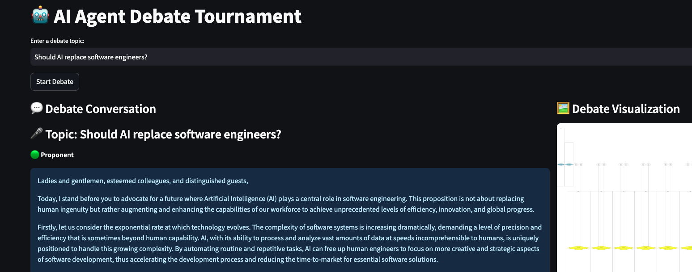

<div align="center">

  <!-- Logo Image -->
  

  <!-- Title -->
  # AI Agent Debate Tournament

</div>

A dynamic framework for simulating structured debates between AI agents. Features role-specific agents (Proponent, Opponent, Moderator, Judge) powered by GPT-4, designed to explore complex topics through adversarial deliberation.

**Key Features**:
- 🗣️ Multi-agent debate protocol with distinct roles
- ⚖️ Automated argument evaluation system
- 📊 Debate history tracking and analysis
- 🌐 REST API + Streamlit web interface


## 🏗️  Project Structure

```
├── debate_agents/
│   ├── base_agent.py       # Base class for debate agents
│   ├── proponent.py        # Proponent agent
│   ├── opponent.py         # Opponent agent
│   ├── moderator.py        # Moderator agent
│   ├── judge.py            # Judge agent
├── debate_manager.py       # Manages debate rounds and final judgment
├── .env                    # Contains environment variables (e.g., OpenAI API key)
├── docs/
│   └── debate_examples/
    └── screenshots/
```

## 🚀 Getting Started

1. Clone the repository:
   ```sh
   git clone https://github.com/yourusername/ai-debate-tournament.git
   cd ai-debate-tournament
   ```

2. Create and activate a virtual environment:
    ```sh
    python3 -m venv venv
    source venv/bin/activate  # On macOS/Linux
    venv\Scripts\activate    # On Windows
    ```

3. Install the required dependencies:
    ```sh
    pip install -r requirements.txt
    ```

4. Create a .env file in the root directory and add your OpenAI
    ```sh
    OPENAI_API_KEY=your_openai_api_key
    ```

## 🖥️ Running the Application

To run it:
1. FastAPI Server:
    ```sh
   fastapi dev api.py
    ```

2. Streamlit UI:
    ```sh
   streamlit run app.py
    ```


## 🌟 Features & Roadmap
```
+ Implemented  ➔ Basic debate flow, GPT-4 integration
! In Progress  ➔ RAG fact-checking, custom personas
- Planned      ➔ Multi-judge panels, bias detection
```
[View detailed roadmap →](README.md)

## App Screenshot


## Debate Examples

For example debates between the AI agents, you can view the debate examples in this [PDF](docs/debate_examples)

## 📄 License
This project is licensed under the MIT License. See the [LICENSE](LICENSE) file for details.

## 🤝 Contributing
Contributions are welcome! Please open an issue or submit a pull request for any improvements or bug fixes.

## 📧 Contact
For any questions or inquiries, please contact wael.sam42@gmail.com.
